# Image Processing Library

A C++ image processing library on BMP images, featuring classical operations and algorithms such as `flipping`, `cropping`, `bit quantization`, `denoising`, `sharpness enhancement`, `luminosity enhancement`, and `chromatic adaptation`.

## Directory Structure

```
.
├── include/         # Library headers
├── src/             # Library implementation
├── examples/        # Example programs
├── images/          # Images for input and output
├── assets/          # Images for README
├── bin/
├── build/
├── Makefile
└── README.md
```

## Features
All operations provide both **in-place** and **non-in-place** APIs.
- Geometric image transformations (flip, crop)
- Bit-depth quantization
- Convolution-based filtering
- Image sharpening using Laplacian kernels
- Median filtering for impulse noise
- Non-Local Means denoising
- Gamma-based luminosity correction
- White balance (Gray World / Max RGB)
- Color enhancement in HSI space
- Color temperature adjustment in YCbCr space

## Quick Example

```C++
BMP img("images/inputs/normal/flower.bmp");

std::vector<std::vector<double>> kernel = {
    {0, -1, 0},
    {-1, 5, -1},
    {0, -1, 0}
};

BMP sharpened = Conv(img, kernel);
sharpened.write("flower_sharpened.bmp");
```

## Examples
### Flipping [`examples/flip.cpp`](examples/flip.cpp)
Source: `src/basic.cpp`
- [`BMP flip_horizontally(const BMP& bmp)`](src/basic.cpp#L73)
- [`void flip_horizontallyInplace(BMP& bmp)`](src/basic.cpp#L80)
- [`BMP flip_vertically(const BMP& bmp)`](src/basic.cpp#L98)
- [`void flip_verticallyInplace(BMP& bmp)`](src/basic.cpp#L105)

| &nbsp;&nbsp;&nbsp;Original&nbsp;&nbsp;&nbsp; | Flipped Horizontally | &nbsp;&nbsp;Flipped Vertically&nbsp;&nbsp; |
|:---:|:---:|:---:|
||||

### Crop [`examples/crop.cpp`](examples/crop.cpp)
Source: `src/basic.cpp`
- [`BMP crop(const BMP& bmp, int x, int y, int w, int h)`](src/basic.cpp#L28)
- [`void cropInplace(BMP& bmp, int x, int y, int w, int h)`](src/basic.cpp#L35)

| Original | Cropped |
|:---:|:---:|
|||

### Bit Quantization [`examples/qbit.cpp`](examples/qbit.cpp)
Source: `src/basic.cpp`
- [`BMP quantize_resolution(const BMP& bmp, int targetBit)`](src/basic.cpp#L13)
- [`void quantize_resolutionInplace(BMP& bmp, int targetBit)`](src/basic.cpp#L20)

| &nbsp;Original(8-bit)&nbsp; | targetBit=6 | targetBit=4 | targetBit=2 | targetBit=1 |
|:---:|:---:|:---:|:---:|:---:|
||||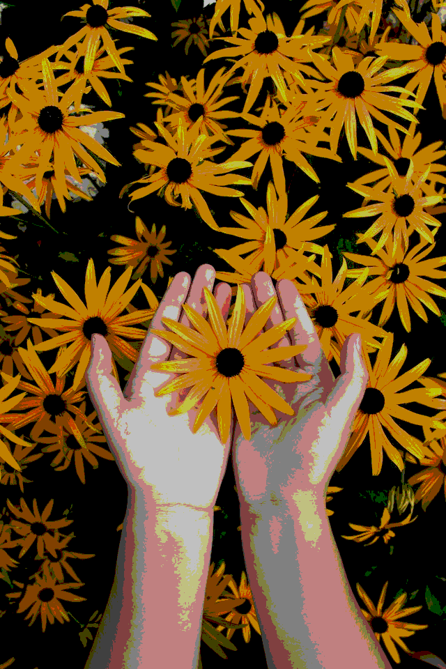|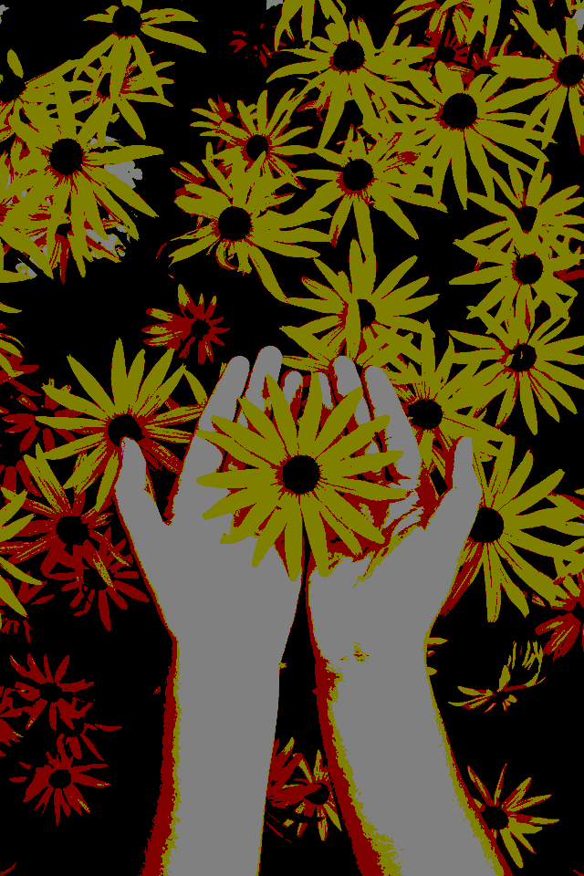|


### Luminosity Enhancement [`examples/gamma_correction.cpp`](examples/gamma_correction.cpp)
Source: `src/ops.cpp`
- [`BMP CorrectGamma(const BMP& bmp, double G)`](src/ops.cpp#L106)
- [`void CorrectGammaInplace(BMP& bmp, double G)`](src/ops.cpp#L113)

The image $ I $ is corrected using formula:
$$ O=I^\frac{1}{G} $$
Pixel values should be normalized to the range [0, 1]. For 8-bit pixel values in the range [0, 255], the formula becomes: 
$$ O=({\frac{I}{255}})^\frac{1}{G} \times 255 $$

| &nbsp;Original&nbsp; | Enhanced (G=2.5) |
|:---:|:---:|
|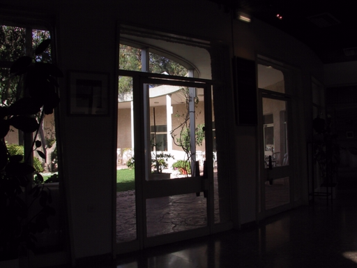|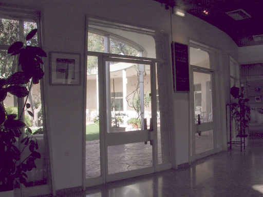|


### Sharpness Enhancement [`examples/sharpen.cpp`](examples/sharpen.cpp)
Source: `src/ops.cpp`
- [`BMP Conv(const BMP& bmp, const std::vector<std::vector<double>>& kernel)`](src/ops.cpp#L121)
- [`void ConvInplace(BMP& bmp, const std::vector<std::vector<double>>& kernel)`](src/ops.cpp#L128)

Image sharpening is implemented using convolution with Laplacian-based kernels.

The Laplacian operator approximates the second-order spatial derivatives of the image and highlights regions with rapid intensity changes (edges). By adding the Laplacian response back to the original image, high-frequency components are amplified, resulting in a sharper appearance.

Two convolution kernels are demonstrated below:
- **Filter 1** considers only horizontal and vertical neighbors (4-neighborhood Laplacian).<br>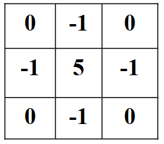
- **Filter 2** additionally incorporates diagonal neighbors (8-neighborhood Laplacian), producing a stronger sharpening effect.<br>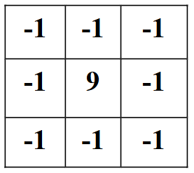


| &nbsp;Original&nbsp; | Filtered1 | Filtered2 |
|:---:|:---:|:---:|
||||


### Denoising [`examples/denoise.cpp`](examples/denoise.cpp)
Source: `src/ops.cpp`
- [`BMP ApplyMedianFilter(const BMP& bmp, int filterSize)`](src/ops.cpp#L175)
- [`void ApplyMedianFilterInplace(BMP& bmp, int filterSize)`](src/ops.cpp#L182)
- [`BMP ApplyNlMeans(const BMP& bmp, float h, float hColor, int templateWindowSize, int searchWindowSize)`](src/ops.cpp#L238)
- [`void ApplyNlMeansInplace(BMP& bmp, float h, float hColor, int templateWindowSize, int searchWindowSize)`](src/ops.cpp#L245)

Different types of image noise require different denoising techniques.

For example, **salt-and-pepper noise** can be effectively removed using a **median filter**, which replaces each pixel with the median value within a local neighborhood. Increasing the `filterSize` generally improves noise suppression but may also introduce noticeable blurring, leading to a trade-off between denoising strength and image sharpness.


| &nbsp;&nbsp;&nbsp;Original&nbsp;&nbsp;&nbsp; | Median Filtered<br>(filterSize=3) | Median Filtered<br>(filterSize=5) |
|:---:|:---:|:---:|
|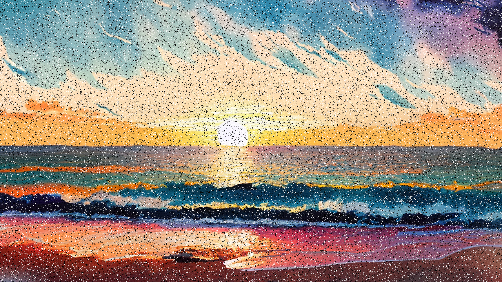|||

For **Gaussian noise**, a common approach is to apply linear convolution using a **Gaussian filter**:

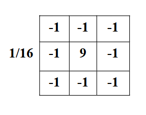

However, Gaussian blur often removes both noise and fine image details.  

A more advanced technique, **Non-Local Means (NLMeans) denoising**, exploits the self-similarity of image patches across the entire image. By comparing patches rather than individual pixels, NLMeans can suppress noise while better preserving textures and structural details.


| Original | Gaussian Blur| Non-Local Means|
|:---:|:---:|:---:|
|||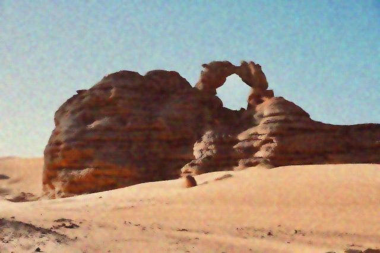|

### Chromatic Adaptation [`examples/chromatic_adaptation.cpp`](examples/chromatic_adaptation.cpp)
Source: `src/color_space.cpp`

- White Balance (mode 0: gray world / mode 1: max RGB)
    - [`BMP CorrectColorTemperature(const BMP& bmp, bool mode)`](src/ops.cpp#L360)
    - [`void CorrectColorTemperatureInplace(BMP& bmp, bool mode)`](src/ops.cpp#L368)
- HSI Color Space Operation
    - [`BMP EnhanceImage(const BMP& bmp, double hueShift, double saturationFactor, double intensityFactor)`](src/ops.cpp#L434)
    - [`void EnhanceImageInplace(BMP& bmp, double hueShift, double saturationFactor, double intensityFactor)`](src/ops.cpp#L441)
- YCbCr Color Space Operation
    - [`BMP AdjustTemp(const BMP& bmp, double CbShift, double CrShift)`](src/ops.cpp#L477)
    - [`void AdjustTempInplace(BMP& bmp, double CbShift, double CrShift)`](src/ops.cpp#L484)

#### White Balance
White balance corrects color casts caused by illumination differences.  
Two classical white balance methods are implemented:

- **Gray World** – assumes that the average color of a natural image should be neutral gray.
- **Max RGB** – assumes that the brightest pixels in each channel correspond to white.

| Original | Gray World | Max RGB |
|:---:|:---:|:---:|
|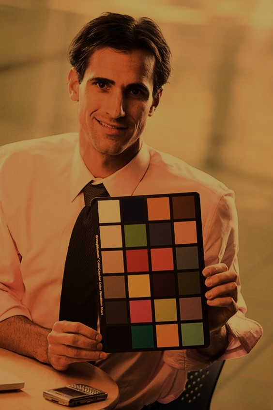|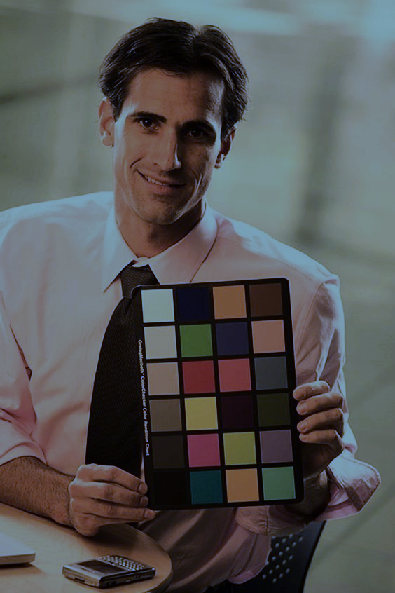|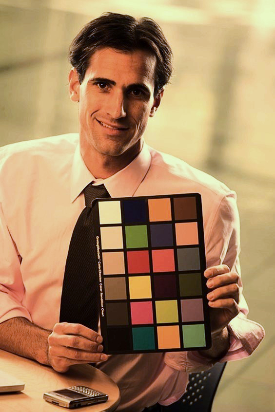|
|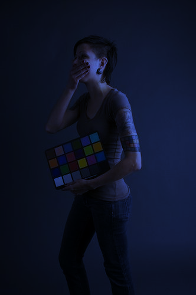|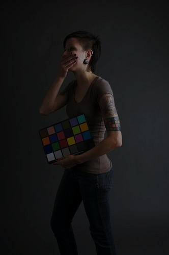||
|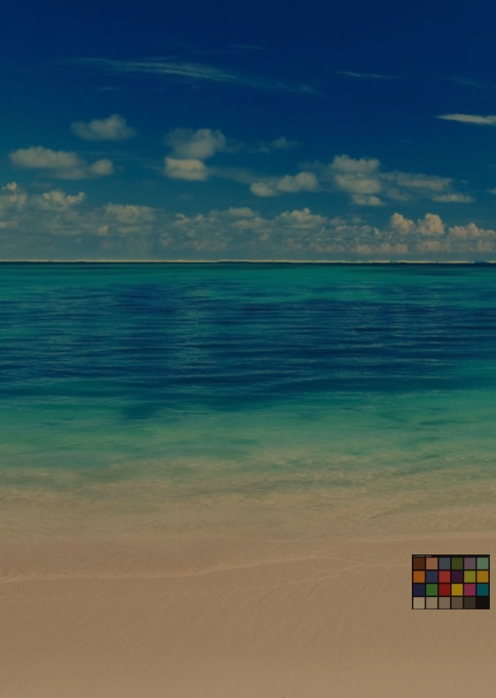|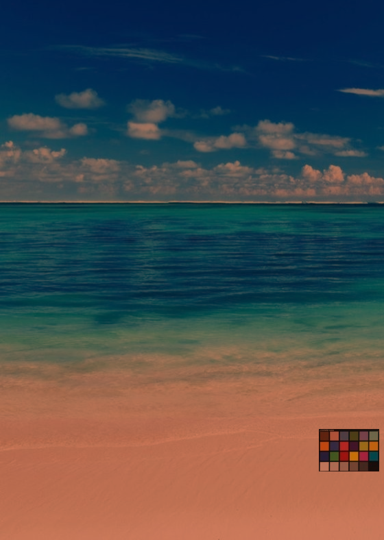|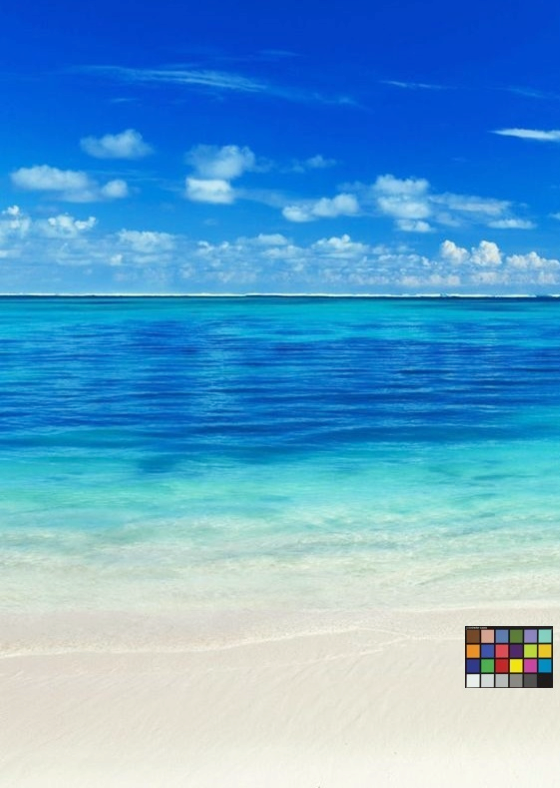|
||||

#### HSI Color Space Enhancement
After white balance correction, the image can be further enhanced in the **HSI color space**.  
HSI separates image color into **Hue (H), Saturation (S), and Intensity (I)** components, which better align with human visual perception.  
This allows independent adjustment of color tone, color richness, and brightness.

| Previously Corrected | Enhanced |
|:---:|:---:|
||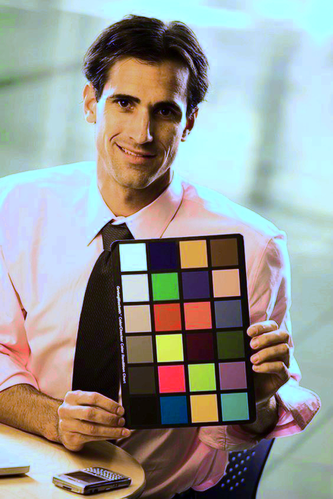|
||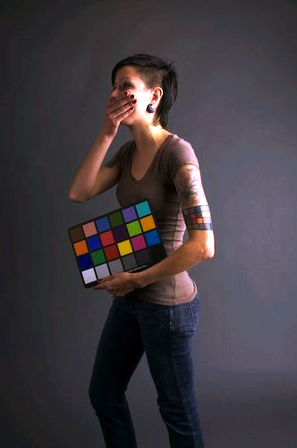|
||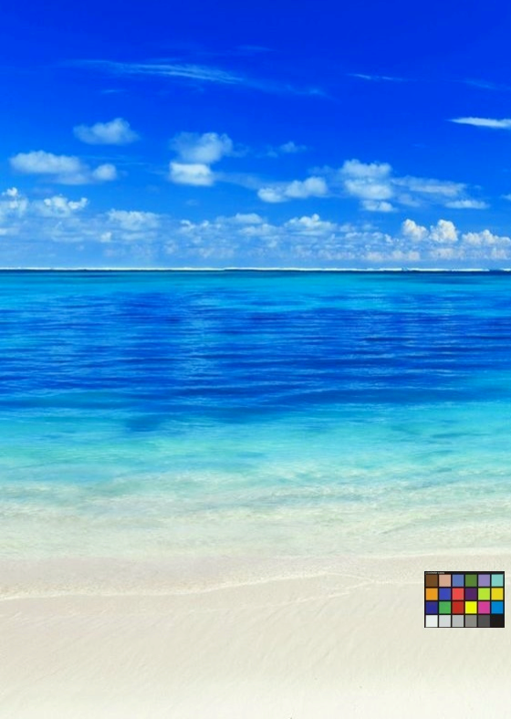|
||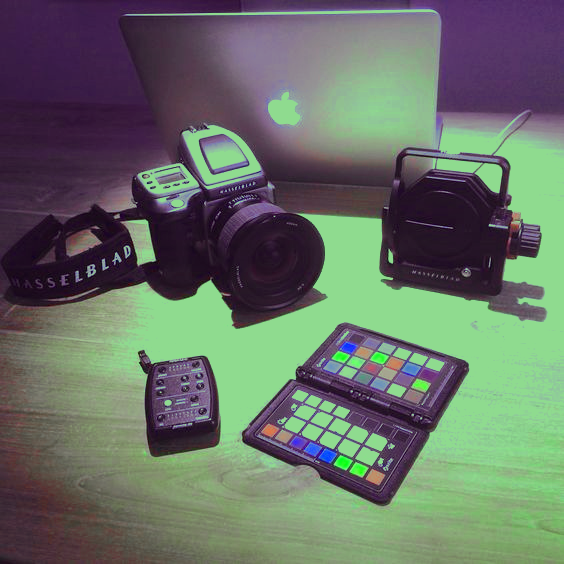|

#### YCbCr Color Temperature Adjustment
The **YCbCr color space** separates luminance (Y) from chrominance components (Cb and Cr).  
This representation is widely used in digital image processing systems such as **image compression and video encoding**.

Here we adjust the chrominance channels to simulate warmer or cooler color temperatures:

| Previously Enhanced | Cb: -0.1 / Cr: +0.1<br>(Warm) | Cb: +0.1 / Cr: -0.1<br>(Cold) |
|:---:|:---:|:---:|
||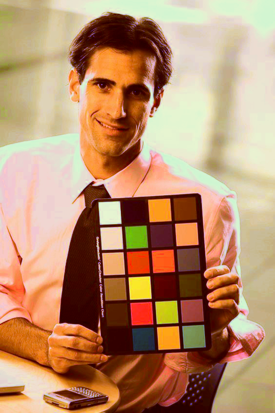|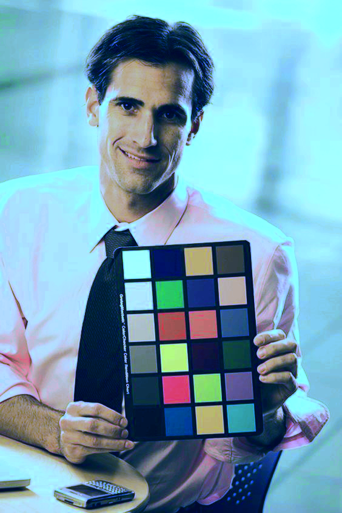|
||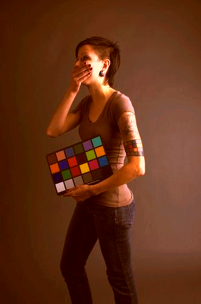|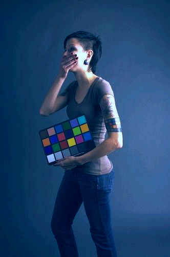|
||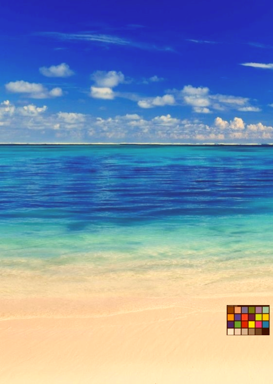|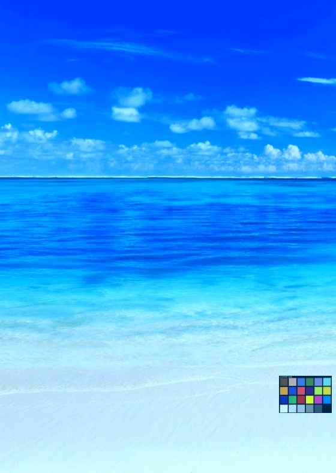|
||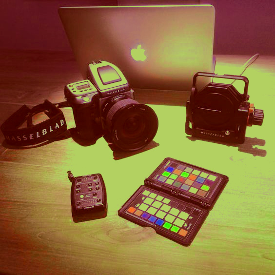|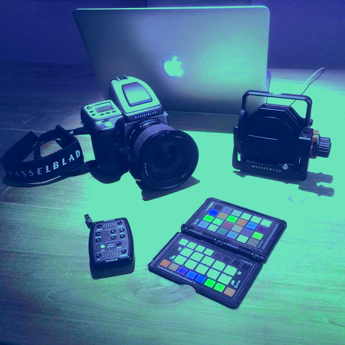|

## Building
To build the library and all example programs, simply run:

```
make
```

This will generate binaries in the `bin/` directory.

## Running Examples

After building, you can run all examples using:

```
make run
```

Or you can run a specific example:

```
./bin/crop
./bin/denoise
./bin/chromatic_adaptation
```

## Cleaning Up

To remove build artifacts and binaries, run:

```
make clean
```

## Dependencies

- C++17 or newer
- No external dependencies (standard C++ and STL only)